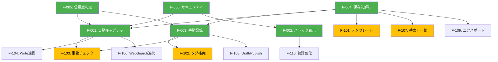

# 機能インベントリ

> **ステータス**: `[Draft]`
> **最終更新**: 2026-02-08

## 概要

til-capture の全機能を一覧化し、v1.0 に向けた優先度を管理する。

## 現行機能（v0.3.0）

| ID | 機能名 | 種別 | 実装 | ステータス | 仕様 |
|----|--------|------|------|-----------|------|
| F-001 | 自動キャプチャ提案 | Stop hook | `hooks/stop-hook.sh` | `[Implemented]` | [03-auto-capture.md](./03-auto-capture.md) |
| F-002 | ストック表示 | SessionStart hook | `hooks/session-start-hook.sh` | `[Implemented]` | [03-auto-capture.md](./03-auto-capture.md) |
| F-003 | 手動 TIL 記録 | Skill | `skills/til/SKILL.md` | `[Implemented]` | [04-manual-capture.md](./04-manual-capture.md) |
| F-004 | 保存先解決（3段階） | ロジック | stop-hook.sh / SKILL.md | `[Implemented]` | [05-config.md](./05-config.md) |
| F-005 | 信頼度ベースの確認 | UX | stop-hook.sh / SKILL.md | `[Implemented]` | [05-config.md](./05-config.md) |
| F-006 | セキュリティ対策 | 基盤 | 全 hook | `[Implemented]` | [security.md](../security.md) |

### 現行機能の詳細

#### F-001: 自動キャプチャ提案

セッション終了時に WebSearch/WebFetch の使用を検知し、TIL 記録を提案する。Stop hook で実装。

- **トリガー**: セッション終了（Stop イベント）
- **検知対象**: トランスクリプト内の `"WebSearch"` / `"WebFetch"` 文字列
- **出力**: `decision: "block"` の JSON レスポンス + TIL 記録指示のメッセージ
- **テスト**: 24 テストケース（`test/stop-hook.bats`）

#### F-002: ストック表示

セッション開始時に TIL の蓄積状況を表示する。SessionStart hook で実装。

- **トリガー**: セッション開始（SessionStart イベント）
- **表示内容**: TIL ディレクトリのパスと .md ファイル数
- **出力**: `hookSpecificOutput` フィールドにステータス文字列
- **テスト**: 12 テストケース（`test/session-start-hook.bats`）

#### F-003: 手動 TIL 記録

`/til` スキルによる任意タイミングでの TIL 記録。

- **トリガー**: ユーザーが `/til` コマンドを実行、または Stop hook からの提案を承認
- **処理**: 学びの特定 → 保存先解決 → Markdown ファイル生成 → 結果報告
- **許可ツール**: Read, Write, Glob, Grep, Bash(date), Bash(mkdir)

#### F-004: 保存先解決（3段階）

CWD → config.json → フォールバック の優先順位で保存先を決定する。

- **優先順位**: `src/content/til/` > `content/til/` > `til/`（CWD内） → `config.json` → `~/til/`
- **設定ファイル**: `~/.config/til-capture/config.json`

#### F-005: 信頼度ベースの確認

保存先の信頼度に応じて、ユーザー確認の要否を切り替える。

- **高信頼**: CWD 内に存在するディレクトリ、config.json 設定 + 存在するディレクトリ
- **低信頼**: config.json 設定 + 未存在、フォールバック `~/til/`

#### F-006: セキュリティ対策

入力バリデーション、パストラバーサル対策、無限ループ防止、TOCTOU 防止。

- 詳細は [security.md](../security.md) を参照

## v1.0 候補機能

| ID | 機能名 | 種別 | 優先度 | 複雑度 | 依存 | ステータス | 仕様 |
|----|--------|------|--------|--------|------|-----------|------|
| F-101 | テンプレートカスタマイズ | 設定拡張 | 高 | 中 | F-004 | `[Draft]` | [06-future-features.md](./06-future-features.md#f-101-テンプレートカスタマイズ) |
| F-102 | タグ自動補完 | UX 改善 | 高 | 中 | F-003 | `[Draft]` | [06-future-features.md](./06-future-features.md#f-102-タグ自動補完) |
| F-103 | 重複チェック | 品質向上 | 中 | 高 | F-001, F-003 | `[Draft]` | [06-future-features.md](./06-future-features.md#f-103-重複チェック) |
| F-104 | PostToolUse(Write) 連携 | Hook 拡張 | 中 | 低 | F-001 | `[Draft]` | [06-future-features.md](./06-future-features.md#f-104-posttoolusewrit-連携) |
| F-105 | UserPromptSubmit 連携 | Hook 拡張 | 低 | 低 | — | `[Draft]` | [06-future-features.md](./06-future-features.md#f-105-userpromptsubmit-連携) |
| F-106 | PostToolUse(WebSearch) 連携 | Hook 拡張 | 中 | 中 | F-001 | `[Draft]` | [06-future-features.md](./06-future-features.md#f-106-posttooluse-websearch-連携) |
| F-107 | TIL 検索・一覧表示 | Skill 追加 | 高 | 低 | F-004 | `[Draft]` | [06-future-features.md](./06-future-features.md#f-107-til-検索一覧表示) |
| F-108 | Draft → Publish ワークフロー | UX 改善 | 低 | 中 | F-003 | `[Draft]` | [06-future-features.md](./06-future-features.md#f-108-draft--publish-ワークフロー) |
| F-109 | エクスポート機能 | Skill 追加 | 低 | 中 | F-004 | `[Draft]` | [06-future-features.md](./06-future-features.md#f-109-エクスポート機能) |
| F-110 | 統計・サマリー表示の強化 | UX 改善 | 中 | 低 | F-002 | `[Draft]` | [06-future-features.md](./06-future-features.md#f-110-統計サマリー表示の強化) |

## 優先度マトリクス

### 評価軸

| 軸 | 説明 | スケール |
|----|------|---------|
| **ユーザー価値** | ユーザーの日常利用に与えるインパクト | 高 / 中 / 低 |
| **実装複雑度** | 実装に必要な工数・技術的難易度 | 高 / 中 / 低 |
| **依存関係** | 他機能への依存・前提条件 | あり / なし |

### マトリクス

```
ユーザー価値: 高
  ┌──────────────────────────────────────────┐
  │  F-107 検索・一覧    │  F-101 テンプレート  │
  │  (複雑度: 低)        │  F-102 タグ補完      │
  │  ★ 優先実装          │  (複雑度: 中)        │
  │                      │  ★ 優先実装          │
  ├──────────────────────┼─────────────────────┤
ユーザー価値: 中
  │  F-104 Write連携     │  F-103 重複チェック  │
  │  F-110 統計強化      │  F-106 WebSearch連携 │
  │  (複雑度: 低)        │  (複雑度: 中〜高)    │
  │  ◎ 次フェーズ        │  ◎ 次フェーズ        │
  ├──────────────────────┼─────────────────────┤
ユーザー価値: 低
  │  F-105 Prompt連携    │  F-108 Draft/Publish │
  │  (複雑度: 低)        │  F-109 エクスポート  │
  │  △ 余裕があれば      │  (複雑度: 中)        │
  │                      │  △ 余裕があれば      │
  └──────────────────────┴─────────────────────┘
    実装複雑度: 低          実装複雑度: 中〜高
```

## 機能間の依存関係



**凡例**: 緑 = Implemented / 黄 = Draft（v1.0 候補）
