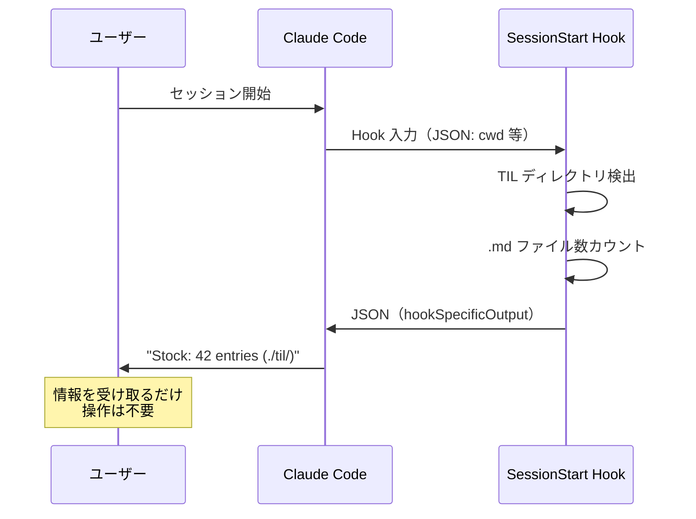
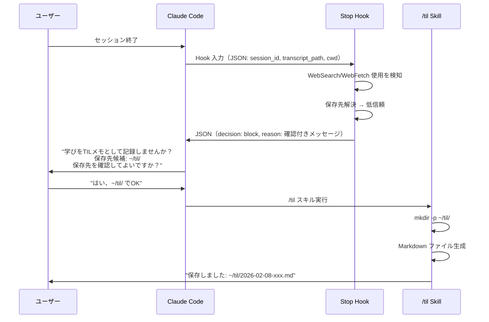
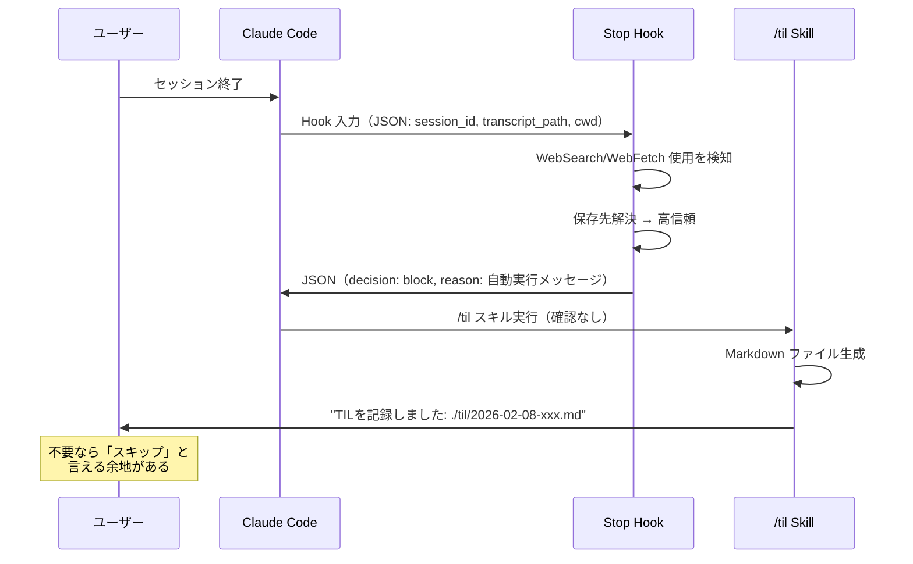
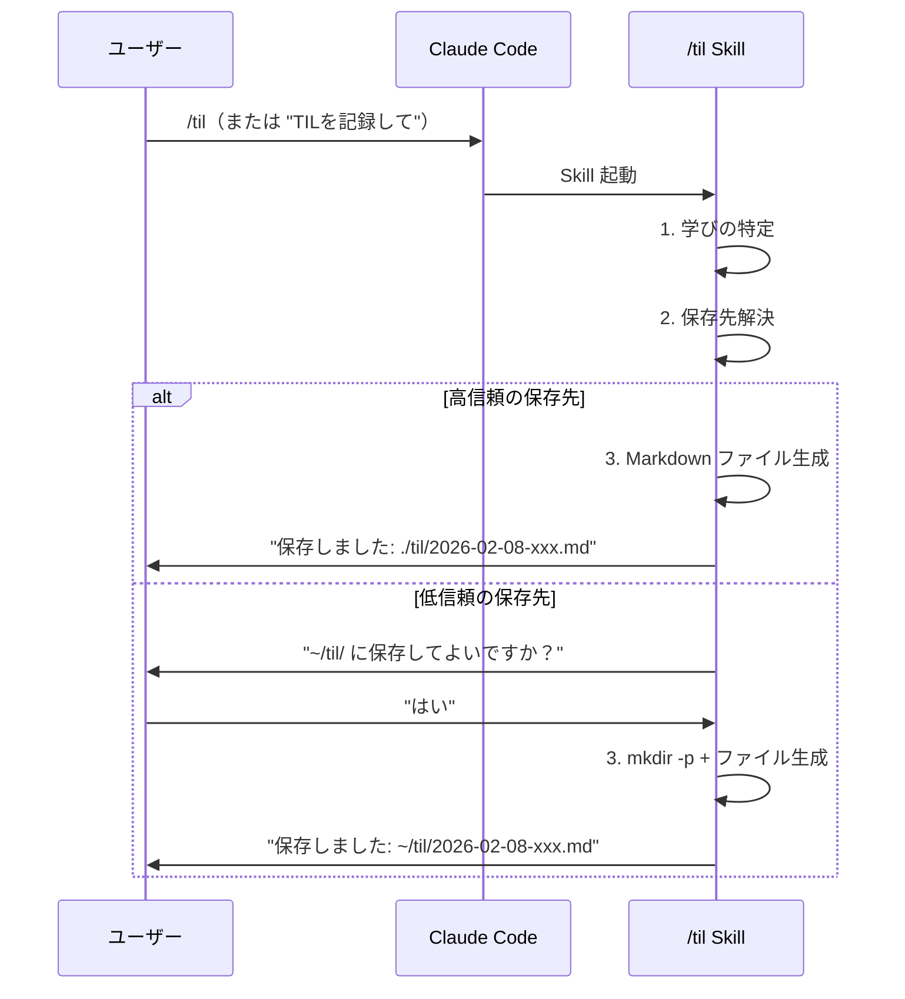

# UI/UX パターン定義

> **ステータス**: `[Draft]`
> **最終更新**: 2026-02-08

## 概要

til-capture は Claude Code のプラグインとして動作するため、通常の GUI アプリケーションとは異なる UI 構造を持つ。本ドキュメントでは、CLI プラグイン特有の UI レイヤーとインタラクションパターンを定義する。

## UI レイヤー定義

til-capture の UI は **Hook → Claude → ユーザー** の 3 層構造で構成される。

| レイヤー | 実装 | ユーザーの体験 | 制御者 |
|---------|------|--------------|--------|
| **Hook 出力** | Shell スクリプト → JSON | Claude 経由のテキスト表示 | Hook スクリプト |
| **Skill 実行** | SKILL.md → Claude が解釈・実行 | Claude との自然言語対話 | Claude（SKILL.md の指示に従う） |
| **生成ファイル** | Markdown ファイル | ファイルシステム上の成果物 | Claude（Write ツール） |

### レイヤーの特性

#### Hook 出力レイヤー

- **制約**: JSON 形式のみ。Claude が解釈してユーザーに伝達する
- **遅延**: タイムアウト 10 秒以内に応答する必要がある
- **副作用**: ファイルシステムへの書き込みはステートファイルのみ
- **現行の出力フォーマット**:
  - Stop hook: `{"decision": "block", "reason": "..."}`
  - SessionStart hook: `{"hookSpecificOutput": {"hookEventName": "SessionStart", "additionalContext": "..."}}`

#### Skill 実行レイヤー

- **制約**: Claude の許可ツールリスト（`allowed-tools`）に基づく
- **対話性**: ユーザーとの自然言語での対話が可能
- **副作用**: ファイル生成（Write）、ディレクトリ作成（Bash:mkdir）

#### 生成ファイルレイヤー

- **形式**: frontmatter 付き Markdown
- **命名規則**: `YYYY-MM-DD-<slug>.md`
- **配置先**: 保存先解決ロジックにより決定（[05-config.md](./05-config.md) 参照）

## インタラクションパターンカタログ

til-capture のすべてのユーザーインタラクションは、以下の 4 パターンに分類される。

### パターン A: 情報通知（一方通行）

**用途**: セッション開始時のステータス表示（F-002）

**特徴**:
- ユーザーからの応答を期待しない
- コンテキスト情報の提供が目的
- Hook の `additionalContext` として出力



**メッセージ例**:

| 状況 | 表示メッセージ |
|------|--------------|
| CWD 内に TIL ディレクトリ存在 | `TIL auto-capture: ON (WebSearch/WebFetch) \| Stock: N entries (パス)` |
| config.json 設定 + ディレクトリ存在 | `TIL auto-capture: ON (WebSearch/WebFetch) \| Stock: N entries (パス)` |
| config.json 設定 + ディレクトリ未存在 | `TIL auto-capture: ON (WebSearch/WebFetch) \| Save to: パス (will ask)` |
| フォールバック | `TIL auto-capture: ON (WebSearch/WebFetch) \| Save to: ~/til/ (will ask, configurable via ~/.config/til-capture/config.json)` |
| 1000件超 | `TIL auto-capture: ON (WebSearch/WebFetch) \| Stock: 1000+ entries (パス)` |

### パターン B: 確認付き提案（低信頼）

**用途**: 低信頼の保存先への TIL 記録提案（F-001 + F-005）

**特徴**:
- Hook が `decision: "block"` で Claude の処理を一時停止
- Claude がユーザーに確認を求める
- ユーザーが承認してから操作を実行



**Hook 出力メッセージ**:
```
この会話でWebSearch/WebFetchを使った調査を行いました。学びをTILメモとして記録しませんか？

保存先候補: ${TIL_DIR}

このディレクトリはまだ存在しないか、明示的に設定されていません。
ユーザーに保存先を確認してから保存してください。
（~/.config/til-capture/config.json で defaultTilDir を設定すると次回から自動保存されます）

手順:
1. ユーザーに「${TIL_DIR} に保存してよいですか？」と確認
2. 承認されたら mkdir -p でディレクトリを作成し保存
3. 拒否またはスキップされたら何もしない
```

### パターン C: 自動実行提案（高信頼）

**用途**: 高信頼の保存先への TIL 記録提案（F-001 + F-005）

**特徴**:
- Hook が `decision: "block"` で Claude の処理を一時停止
- Claude が即座に /til スキルを実行（保存先の確認は不要）
- ただし「不要と判断した場合はスキップ」の余地を残す



**Hook 出力メッセージ**:
```
この会話でWebSearch/WebFetchを使った調査を行いました。学びをTILメモとして記録します。

保存先: ${TIL_DIR}

以下の手順で実行してください:
1. 会話で得られた新しい知識・発見を特定
2. 保存先ディレクトリ ${TIL_DIR} に保存
3. frontmatter付きMarkdownファイルとして保存
4. 保存結果を報告

ユーザーが不要と判断した場合はスキップしてください。
```

### パターン D: コマンド起点の対話型実行

**用途**: `/til` スキルによる手動 TIL 記録（F-003）

**特徴**:
- ユーザーが明示的にコマンドを実行
- Claude が SKILL.md の手順に従って処理
- 保存先が低信頼の場合のみユーザー確認



**Skill トリガー**:
- `/til-capture:til` コマンド
- 自然言語: "TILを記録", "学びを保存", "record a TIL" 等
- Stop hook からの提案（パターン B/C 経由）

### パターン対応表

| パターン | トリガー | 信頼度 | ユーザー確認 | 使用する機能 |
|---------|---------|--------|------------|------------|
| A: 情報通知 | セッション開始 | — | 不要 | F-002 |
| B: 確認付き提案 | セッション終了 | 低 | 必要 | F-001, F-005 |
| C: 自動実行提案 | セッション終了 | 高 | 不要（スキップ可） | F-001, F-005 |
| D: 対話型実行 | ユーザーコマンド | 両方 | 低信頼時のみ | F-003 |

## メッセージ設計ガイドライン

### トーン

| 原則 | 説明 | 良い例 | 悪い例 |
|------|------|--------|--------|
| **簡潔** | 必要な情報を最小限の文で伝える | "Stock: 42 entries" | "現在42件のTILが蓄積されています！" |
| **行動指向** | 次にすべきことを明示する | "保存先を確認してください" | "保存先が設定されていない可能性があります" |
| **押しつけない** | ユーザーの判断を尊重する | "不要ならスキップしてください" | "必ず記録してください" |
| **一貫性** | 同じ概念に同じ表現を使う | "保存先" で統一 | "出力先" "保存場所" の混用 |

### フォーマット規約

| 要素 | フォーマット | 例 |
|------|------------|-----|
| パス | そのまま表示 | `./til/`, `~/til/` |
| 件数 | `N entries` | `Stock: 42 entries` |
| 大量件数 | `1000+ entries` | `Stock: 1000+ entries` |
| 信頼度表示 | 高: 省略 / 低: `(will ask)` | `Save to: ~/til/ (will ask)` |
| 設定案内 | 括弧内に記載 | `(configurable via ~/.config/til-capture/config.json)` |

### エラー表現

| 種別 | 方針 | 例 |
|------|------|-----|
| **依存不足** | stderr に出力、非ゼロ終了 | `"Error: til-capture: jq is required but not installed"` |
| **入力不正** | 静かに終了（exit 0） | セキュリティ考慮で詳細を出さない |
| **設定不正** | フォールバックで継続 | パストラバーサル値は無視して次の解決手段へ |

## Hook レスポンス JSON スキーマ

### Stop hook 出力

```jsonc
// 学びが検知された場合のみ出力
{
  "decision": "block",       // 必須: Claude の処理を一時停止
  "reason": "string"         // 必須: TIL 記録指示メッセージ（信頼度により内容が変わる）
}
// 学びが検知されなかった場合: 出力なし（exit 0）
```

**Stop hook 入力**（Claude Code が提供）:

```jsonc
{
  "session_id": "string",           // セッション識別子
  "transcript_path": "string",      // トランスクリプトファイルパス
  "cwd": "string",                  // カレントワーキングディレクトリ
  "stop_hook_active": true | false  // 無限ループ防止フラグ
}
```

### SessionStart hook 出力

```jsonc
// 常に出力
{
  "hookSpecificOutput": {
    "hookEventName": "SessionStart",
    "additionalContext": "string"    // ステータス文字列
  }
}
```

**SessionStart hook 入力**（Claude Code が提供）:

```jsonc
{
  "cwd": "string"  // カレントワーキングディレクトリ
}
```

## Skill 仕様フォーマット

### frontmatter

```yaml
---
name: til                      # スキル識別子
description: >                 # トリガー条件の説明（自然言語）
  This skill should be used when the user asks to "record a TIL", ...
allowed-tools: Read, Write, Glob, Grep, Bash(date:*), Bash(mkdir:*)
---
```

### allowed-tools の設計方針

| ツール | 用途 | 制限 |
|--------|------|------|
| `Read` | config.json 読み取り、既存 TIL 参照 | — |
| `Write` | TIL ファイル生成 | — |
| `Glob` | 保存先ディレクトリの探索 | 無制限検索は禁止（SKILL.md で明記） |
| `Grep` | 既存 TIL の内容検索 | — |
| `Bash(date:*)` | 日付取得 | date コマンドのみ |
| `Bash(mkdir:*)` | ディレクトリ作成 | mkdir コマンドのみ |

### 引数仕様

- `$ARGUMENTS`: スキル呼び出し時のオプション引数
- 用途: カテゴリやトピックのヒントとして使用
- 未指定時: 会話コンテキストから自動判定

## 生成ファイルの仕様

### ファイル名

```
YYYY-MM-DD-<slug>.md
```

- `YYYY-MM-DD`: 生成日（`date +%Y-%m-%d` で取得）
- `<slug>`: タイトルから英語 kebab-case で生成（例: `using-jq-for-json-parsing`）

### テンプレート

```markdown
---
title: "学びのタイトル"
date: YYYY-MM-DD
tags: [tag1, tag2]
draft: true
---

## 概要
（1-2文の要約）

## 詳細
（学びの詳細な説明）

## コード例
（該当する場合のみ）

## 参考
（関連リンクや背景情報）
```

### frontmatter フィールド

| フィールド | 型 | 必須 | 説明 |
|-----------|-----|------|------|
| `title` | string | Yes | 学びのタイトル（日本語可） |
| `date` | string (YYYY-MM-DD) | Yes | 記録日 |
| `tags` | string[] | Yes | 分類タグ（1個以上） |
| `draft` | boolean | Yes | ドラフト状態（常に `true` で生成） |
