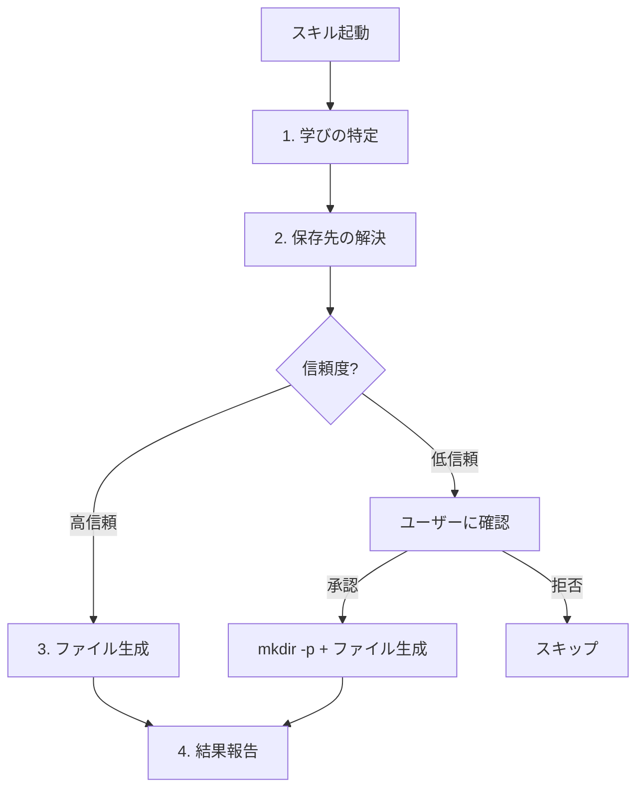

# 機能仕様: 手動キャプチャ

> **ステータス**: `[Implemented]` (v0.3.0)
> **最終更新**: 2026-02-08

## 概要

| 項目 | 値 |
|------|-----|
| **機能 ID** | F-003 |
| **種別** | Skill |
| **実装** | `skills/til/SKILL.md` |
| **テスト** | なし（Skill は Claude の解釈に依存するため、E2E テストの対象外） |
| **UX パターン** | D（コマンド起点の対話型実行） |

## ユーザーストーリー

> 開発者として、セッション中の任意のタイミングで学びを TIL として記録したい。自動キャプチャを待たず、重要な学びをその場で残せるようにしたい。

## トリガー条件

以下のいずれかでスキルが起動する:

| トリガー | 例 |
|---------|-----|
| コマンド | `/til-capture:til` |
| 自然言語（英語） | "record a TIL", "capture what I learned", "save today's learning" |
| 自然言語（日本語） | "TILを記録", "学びを保存" |
| Stop hook からの提案 | パターン B/C 経由で Claude が /til を実行 |

### 引数

- `$ARGUMENTS`: オプション。カテゴリやトピックのヒントとして使用
- 未指定時: 会話コンテキストから Claude が自動判定

## 振る舞い仕様

### 処理フロー



### Step 1: 学びの特定

Claude が会話コンテキストから以下を抽出する:

| 抽出対象 | 説明 | 例 |
|---------|------|-----|
| 技術的な学び | ツールの使い方、API の仕様など | "jq の `-r` フラグで raw output" |
| 調査で分かった事実 | 仕様、ベストプラクティスなど | "bash の `set -C` で noclobber" |
| 失敗から得た教訓 | デバッグのコツ、避けるべきパターン | "TOCTOU 問題を避けるには..." |

### Step 2: 保存先の解決

保存先の解決ロジックは [05-config.md](./05-config.md) で定義。ここでは Skill 実装固有の振る舞いを記述する。

| # | 条件 | 動作 | UX パターン |
|---|------|------|-----------|
| 1 | CWD 内に TIL ディレクトリ存在 | そのまま保存 | D（確認なし） |
| 2 | config.json + ディレクトリ存在 | そのまま保存 | D（確認なし） |
| 3 | config.json + ディレクトリ未存在 | ユーザー確認 → `mkdir -p` | D（確認あり） |
| 4 | フォールバック `~/til/` | ユーザー確認 → `mkdir -p` | D（確認あり） |

**制約事項**:
- Glob での無制限検索は行わない（SKILL.md で明記）
- 低信頼パス（`~/til/` フォールバック）は必ずユーザー確認を行う
- `mkdir -p` はユーザー承認後のみ実行可

### Step 3: ファイル生成

#### ファイル名規則

```
YYYY-MM-DD-<slug>.md
```

- `YYYY-MM-DD`: `date +%Y-%m-%d` で取得した生成日
- `<slug>`: タイトルから生成した英語 kebab-case

#### テンプレート

```markdown
---
title: "学びのタイトル"
date: YYYY-MM-DD
tags: [tag1, tag2]
draft: true
---

## 概要
（1-2文の要約）

## 詳細
（学びの詳細な説明）

## コード例
（該当する場合のみ）

## 参考
（関連リンクや背景情報）
```

#### frontmatter フィールド

| フィールド | 型 | 必須 | 生成方法 |
|-----------|-----|------|---------|
| `title` | string | Yes | Claude が学びの内容から生成 |
| `date` | string (YYYY-MM-DD) | Yes | `date +%Y-%m-%d` |
| `tags` | string[] | Yes | Claude が内容から推定（1個以上） |
| `draft` | boolean | Yes | 常に `true` |

#### セクション

| セクション | 必須 | 説明 |
|-----------|------|------|
| 概要 | Yes | 1-2 文の要約 |
| 詳細 | Yes | 学びの詳細な説明 |
| コード例 | No | 該当する場合のみ |
| 参考 | No | 関連リンクや背景情報 |

### Step 4: 結果報告

保存完了後、以下を報告する:

- 保存先ファイルパス
- 内容のサマリー（タイトル、タグ）

## 許可ツール

| ツール | 用途 | 制限 |
|--------|------|------|
| `Read` | config.json 読み取り、既存 TIL 参照 | — |
| `Write` | TIL ファイル生成 | — |
| `Glob` | 保存先ディレクトリの探索 | **無制限検索は禁止** |
| `Grep` | 既存 TIL の内容検索 | — |
| `Bash(date:*)` | 日付取得 | `date` コマンドのみ |
| `Bash(mkdir:*)` | ディレクトリ作成 | `mkdir` コマンドのみ |

## セキュリティ要件

- 保存先の検証は [05-config.md](./05-config.md) のロジックに従う
- Glob の無制限検索禁止は SKILL.md 内で明記されているが、Claude の解釈に依存する
- `mkdir -p` は低信頼パス時にユーザー確認後のみ実行

## v1.0 での変更予定

Phase 4（[06-future-features.md](./06-future-features.md)）で詳細化予定:

- **F-101: テンプレートカスタマイズ** — frontmatter/セクション構成の設定化
- **F-102: タグ自動補完** — 既存 TIL からのタグ抽出と提案
- **F-103: 重複チェック** — 類似 TIL の検出と警告
- **F-108: Draft → Publish ワークフロー** — `draft: true` → `draft: false` の管理
