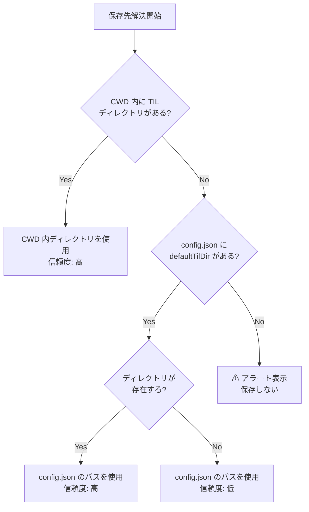

# 機能仕様: 設定・保存先解決

> **ステータス**: `[Implemented]` (v1.0.0)
> **最終更新**: 2026-02-08

## 概要

| 項目 | 値 |
|------|-----|
| **機能 ID** | F-004（保存先解決）、F-005（信頼度ベースの確認） |
| **種別** | ロジック / UX |
| **実装** | `hooks/stop-hook.sh`（L60-95）/ `hooks/session-start-hook.sh`（L18-54）/ `skills/til/SKILL.md` |
| **テスト** | stop-hook.bats #10-19, #23-24 / session-start-hook.bats #1-10 |

## ユーザーストーリー

### F-004: 保存先解決

> 開発者として、TIL の保存先を明示的に設定しなくても適切な場所に保存されてほしい。プロジェクト内に TIL ディレクトリがあればそこに、なければ設定に従ってほしい。

### F-005: 信頼度ベースの確認

> 開発者として、よく使う保存先には確認なしで保存してほしいが、初めて使う場所やフォールバック先には確認を求めてほしい。

## 保存先解決ロジック

### 優先順位



### Step 1: CWD 内のプロジェクトディレクトリ

以下の 3 つのパスを CWD からの相対パスで**順に**存在確認する。最初に見つかったディレクトリを使用する。

| 優先度 | パス | 想定用途 |
|--------|------|---------|
| 1 | `{CWD}/src/content/til/` | Astro 等の SSG プロジェクト |
| 2 | `{CWD}/content/til/` | Hugo 等の SSG プロジェクト |
| 3 | `{CWD}/til/` | 汎用プロジェクト |

**信頼度**: 高（ディレクトリが存在するため）

**テストケースとの紐付け**:

| テスト | 条件 | 検証内容 |
|--------|------|---------|
| stop-hook.bats #10 | `til/` 存在 | 高信頼メッセージ |
| stop-hook.bats #11 | `content/til/` 存在 | 高信頼メッセージ + 正しいパス |
| stop-hook.bats #12 | `src/content/til/` 存在 | 高信頼メッセージ + 正しいパス |
| stop-hook.bats #13 | 3つ全部存在 | `src/content/til` が選択される |
| stop-hook.bats #17 | CWD `til/` + config.json | CWD が優先 |
| session-start-hook.bats #1 | `til/` 存在 | Stock 表示 |
| session-start-hook.bats #2 | `content/til/` 存在 | 正しいカウント |
| session-start-hook.bats #3 | `src/content/til/` 存在 | 正しいカウント + パス |
| session-start-hook.bats #10 | CWD `til/` + config.json | CWD が優先 |

### Step 2: config.json の defaultTilDir

CWD 内にディレクトリが見つからない場合、設定ファイルを参照する。

#### 設定ファイル

| 項目 | 値 |
|------|-----|
| **パス** | `~/.config/til-capture/config.json` |
| **形式** | JSON |
| **必須** | No（ファイルが存在しなくてもエラーにならない） |

#### スキーマ

```jsonc
{
  "defaultTilDir": "/absolute/path/to/til",  // 絶対パス必須
  "author": "username"                        // v1.1 で追加、省略可
}
```

#### バリデーションルール

| チェック | 不正時の動作 | テストケース |
|---------|------------|------------|
| 絶対パスであること（`/` 始まり） | 値を無視してフォールバック | stop-hook.bats #24 |
| `..` を含まないこと | 値を無視してフォールバック | stop-hook.bats #23 |
| JSON パースエラー | 値を無視してフォールバック | — |
| `defaultTilDir` フィールド未設定 | 値を無視してフォールバック | — |

#### author フィールド（v1.1 で追加）

| チェック | 不正時の動作 |
|---------|------------|
| 文字列であること | 値を無視（author なしとして動作） |
| 空文字列でないこと | 値を無視（author なしとして動作） |

#### 信頼度判定

| 条件 | 信頼度 | テストケース |
|------|--------|------------|
| `defaultTilDir` のディレクトリが存在する | 高 | stop-hook.bats #14 / session-start-hook.bats #7 |
| `defaultTilDir` のディレクトリが存在しない | 低 | stop-hook.bats #15 / session-start-hook.bats #8 |

### Step 3: 保存先未設定時のアラート（v1.0 で実装）

> **v1.0 変更（[ADR-004](../adr/ADR-004-directory-resolution-strategy.md)）**: v0.3 のフォールバック `~/til/` を削除。CWD に `til/` がなく、config.json にも `defaultTilDir` が設定されていない場合は、アラートを表示して保存を行わない。

Step 1, 2 で保存先が決まらない場合、保存は行わずアラートメッセージを表示する。

| 項目 | 値 |
|------|-----|
| **動作** | アラート表示（保存しない） |
| **Stop hook** | `decision: "block"` + 設定手順を案内 |
| **SessionStart hook** | ⚠ メッセージ + 設定手順を案内 |
| **テストケース** | stop-hook.bats #16,#19,#23,#24,#25 / session-start-hook.bats #9,#13 |

## 信頼度ベースの確認（F-005）

### 信頼度テーブル

| 信頼度 | 条件 | Stop hook の動作 | Skill の動作 |
|--------|------|----------------|-------------|
| **高** | CWD 内ディレクトリ存在 | 自動実行メッセージ（パターン C） | 確認なしで保存 |
| **高** | config.json + ディレクトリ存在 | 自動実行メッセージ（パターン C） | 確認なしで保存 |
| **低** | config.json + ディレクトリ未存在 | 確認付きメッセージ（パターン B） | ユーザー確認後に保存 |
| **—** | 保存先未設定 | アラート表示（保存しない） | 設定を案内して終了 |

### メッセージの違い

#### 高信頼メッセージ（パターン C）

```
保存先: {パス}
```
- 「記録します」（断定的）
- 手順の提示: 特定 → 保存 → 報告
- 「ユーザーが不要と判断した場合はスキップ」の余地

#### 低信頼メッセージ（パターン B）

```
保存先候補: {パス}
```
- 「記録しませんか？」（提案的）
- 「このディレクトリはまだ存在しないか、明示的に設定されていません」
- 手順: 確認 → 承認で保存 / 拒否でスキップ
- config.json 設定の案内

**テストケースとの紐付け**:

| テスト | 検証内容 |
|--------|---------|
| stop-hook.bats #18 | 高信頼: `保存先:` と `保存先ディレクトリ` がメッセージに含まれる |
| stop-hook.bats #19 | 低信頼: `保存先候補:` と `保存してよいですか` がメッセージに含まれる |
| stop-hook.bats #14 | config.json 高信頼: `記録します` が含まれる |
| stop-hook.bats #15 | config.json 低信頼: `確認` が含まれる |

## 実装ごとの差異

保存先解決ロジックは 3 つの実装で共有されるが、微妙な差異がある:

| 実装 | CWD 検証 | config.json パス検証 | フォールバック動作 |
|------|---------|-------------------|--------------------|
| **stop-hook.sh** | 不正値 → `exit 0` | 不正値 → 空文字化 → アラート | アラート表示（`decision: "block"`） |
| **session-start-hook.sh** | 不正値 → 空文字化 | 不正値 → 空文字化 → アラート | ⚠ メッセージ表示 |
| **SKILL.md** | Claude の判断に依存 | Claude が Read で読み取り | 設定を案内して終了 |

> **設計ノート**: Hook（Shell スクリプト）は厳密なバリデーションを行うが、Skill（Claude 解釈）は SKILL.md の指示に従う柔軟な動作となる。信頼度の概念は共通だが、実装手段が異なる。

## セキュリティ要件

- パストラバーサル対策: [security.md §2](../security.md)
- config.json の不正値は静かにアラート表示に移行（エラーメッセージを出さない）
- 保存先未設定時は保存を行わない（意図しない書き込みの防止）

## v1.0 での変更（実装済み）

1. **フォールバック `~/til/` の削除**（[ADR-004](../adr/ADR-004-directory-resolution-strategy.md)）
   - CWD `til/` も config.json `defaultTilDir` もない場合 → アラート表示、保存しない
   - config.json が存在するが `defaultTilDir` が null/空 → アラート表示
   - SessionStart hook のアラートメッセージで設定手順を案内

2. **config.json `defaultTilDir` の実質必須化**（[ADR-004](../adr/ADR-004-directory-resolution-strategy.md)）
   - CWD 内に `til/` がない環境では、config.json の設定が必須

### v1.1+ で検討

- **F-101: テンプレートカスタマイズ** — config.json の拡張（テンプレート設定の追加）
- config.json スキーマの拡張可能性:
  ```jsonc
  {
    "defaultTilDir": "/path/to/til",  // v1.0 で実質必須化
    "author": "username",             // v1.1 で追加（チーム利用対応）
    "template": {                      // F-101 で追加予定（将来）
      "frontmatter": { ... },
      "sections": [ ... ]
    }
  }
  ```
