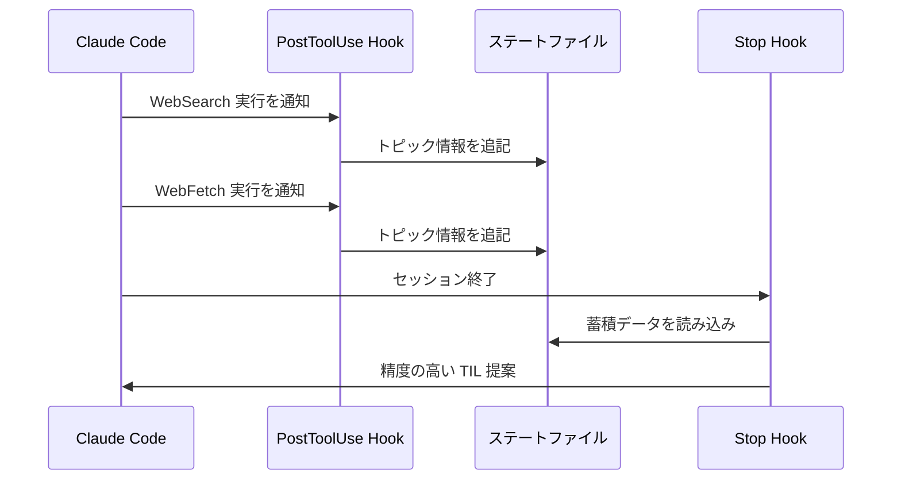

# v1.0 候補機能の仕様ドラフト

> **ステータス**: `[Draft]`
> **最終更新**: 2026-02-08

## 概要

v1.0 以降で実装する候補機能を記載する。[ADR-002](../adr/ADR-002-v1-feature-priority.md) の決定に基づき、**v1.0 確定**（F-102, F-107）と **v1.1+ 以降**（その他）に分類している。

> **TIL の位置づけ**: 個人の知識整理・学びなおしのツール（ADR-002）。参照効率の向上が最も高い価値。

---

## v1.0 確定

### F-102: タグ自動補完 → [下記](#f-102-タグ自動補完)
### F-107: TIL 検索・一覧表示 → [下記](#f-107-til-検索一覧表示)

---

## v1.1+ 以降

### F-101: テンプレートカスタマイズ

> **ステータス**: `[Draft]` — v1.1+ へ延期（[ADR-002](../adr/ADR-002-v1-feature-priority.md)）
>
> 当初は v1.0 の候補でしたが、TIL の位置づけを「個人の知識整理ツール」に再定義したことで、SSG 公開向けカスタマイズの優先度が低下しました。

| 項目 | 値 |
|------|-----|
| **リリース** | v1.1+ |
| **複雑度** | 中 |
| **依存** | F-004（保存先解決 / config.json） |
| **UX パターン** | D（対話型実行） |

#### 課題

現在の TIL テンプレート（frontmatter + セクション構成）はハードコードされている。ブログの SSG やチームの運用に合わせてカスタマイズしたいニーズがある。

- Hugo プロジェクトでは `categories` フィールドが必要
- チーム運用では `author` フィールドを追加したい
- セクション構成（概要/詳細/コード例/参考）を変更したい

#### 提案する解決策

config.json に `template` セクションを追加し、frontmatter とセクション構成をカスタマイズ可能にする。

**拡張後の config.json スキーマ**:

```jsonc
{
  "defaultTilDir": "/path/to/til",
  "template": {
    "frontmatter": {
      // デフォルト値を上書き・追加
      "draft": false,                    // デフォルトは true
      "author": "yourname",              // 追加フィールド
      "categories": ["til"]              // 追加フィールド
    },
    "sections": [
      // セクション構成をカスタマイズ（省略時はデフォルト）
      { "heading": "概要", "required": true, "hint": "1-2文の要約" },
      { "heading": "詳細", "required": true },
      { "heading": "コード例", "required": false },
      { "heading": "参考", "required": false }
    ]
  }
}
```

**動作**:
- `template` セクション未設定時: 現行テンプレートをそのまま使用（後方互換）
- `frontmatter` のみ設定時: デフォルトに上書きマージ
- `sections` のみ設定時: デフォルトセクションを完全に置換

#### 技術的検討事項

- config.json のスキーマバリデーション: 不正な `template` は無視して現行テンプレートにフォールバック
- `sections` の `required` フラグ: Claude への指示に反映（必須セクションは省略不可と伝える）
- SKILL.md の変更: テンプレート読み込みステップの追加

#### 影響範囲

- `skills/til/SKILL.md`: テンプレート読み込みロジック追加
- `hooks/stop-hook.sh`: メッセージへのテンプレート情報反映（任意）
- `test/`: config.json テンプレート設定のテスト追加

---

### F-102: タグ自動補完

> **ステータス**: `[Accepted]` — v1.0 確定（[ADR-002](../adr/ADR-002-v1-feature-priority.md)）

| 項目 | 値 |
|------|-----|
| **リリース** | **v1.0** |
| **複雑度** | 中 |
| **依存** | F-003（手動記録 / /til スキル） |
| **UX パターン** | D（対話型実行） |

#### 課題

TIL のタグは Claude が会話コンテキストから推定するが、既存の TIL で使われているタグとの一貫性がない。同じ概念に対して `javascript` / `js` / `JavaScript` のような揺れが発生する。

#### 提案する解決策

既存 TIL の frontmatter からタグを抽出し、新規 TIL 作成時に既存タグを優先的に使用する。

**処理フロー**:

```mermaid
flowchart TD
    A[/til スキル起動] --> B[保存先ディレクトリ特定]
    B --> C["既存 .md から frontmatter の tags を抽出"]
    C --> D[タグ頻度の集計]
    D --> E[Claude が内容からタグ候補を生成]
    E --> F{既存タグに<br/>一致するものがある?}
    F -->|Yes| G[既存タグを優先使用]
    F -->|No| H[新規タグを使用]
    G --> I[TIL 生成]
    H --> I
```

#### 技術的検討事項

- **性能**: ファイル走査は保存先ディレクトリ内のみ。Glob で `.md` ファイルを列挙し、Grep で `tags:` 行を抽出
- **走査上限**: 100 ファイルを上限とする（最新のファイルから優先）
- **タグ正規化**: 小文字化して比較、表示は最も頻度の高い表記を採用
- **Glob 制限**: SKILL.md の「無制限検索禁止」制約に準拠

#### 影響範囲

- `skills/til/SKILL.md`: タグ抽出ステップの追加
- 既存テストへの影響なし

---

### F-107: TIL 検索・一覧表示

> **ステータス**: `[Accepted]` — v1.0 確定（[ADR-002](../adr/ADR-002-v1-feature-priority.md)）

| 項目 | 値 |
|------|-----|
| **リリース** | **v1.0** |
| **複雑度** | 低 |
| **依存** | F-004（保存先解決） |
| **UX パターン** | D（対話型実行） |

#### 課題

蓄積した TIL を検索・一覧表示する手段がない。ファイルシステム上の `grep` は可能だが、Claude Code セッション内でシームレスに検索したい。

#### 提案する解決策

新規 Skill `/til-list` を追加し、TIL の一覧表示・検索を行う。

**コマンド例**:
- `/til-list` — 直近 10 件の TIL を一覧表示
- `/til-list search <keyword>` — キーワードで全文検索
- `/til-list tags` — タグ別の件数を表示

**出力フォーマット**:
```
📋 TIL 一覧（直近 10 件）
1. 2026-02-08 - jq で JSON パースする方法 [bash, json]
2. 2026-02-07 - noclobber でアトミック操作 [bash, security]
...
```

#### 技術的検討事項

- 新規 Skill ファイル: `skills/til-list/SKILL.md`
- 許可ツール: `Read`, `Glob`, `Grep`（書き込みは不要）
- 性能: 一覧表示は直近 N 件、検索は Grep に委ねる

#### 影響範囲

- 新規ファイル: `skills/til-list/SKILL.md`
- 既存機能への影響なし

---

## 次フェーズ

### F-103: 重複チェック

| 項目 | 値 |
|------|-----|
| **優先度** | 中 |
| **複雑度** | 高 |
| **依存** | F-001, F-003 |
| **UX パターン** | B（確認付き提案） |

#### 課題

同じトピックについて複数回 WebSearch した場合、類似する TIL が重複して作成される可能性がある。

#### 提案する解決策

TIL 保存前に既存 TIL との類似度をチェックし、類似する TIL が存在する場合はユーザーに通知する。

**方式の検討**:

| 方式 | メリット | デメリット |
|------|---------|-----------|
| タイトル一致 | 実装が簡単 | 表現揺れに弱い |
| タグ + 日付 | 同日の類似トピックを検出 | 精度が低い |
| Claude に判断を委ねる | 柔軟な類似度判定 | 処理コスト |

**推奨**: Claude に判断を委ねる方式。SKILL.md に「保存前に既存 TIL のタイトルとタグを確認し、類似するものがあれば報告する」という手順を追加。

#### 技術的検討事項

- 走査対象: 直近 30 日分の TIL（ファイル名の日付でフィルタ）
- Claude への指示: 「類似 TIL が見つかった場合、既存 TIL を更新するか新規作成するかをユーザーに確認」
- 既存 TIL の更新機能は本機能のスコープ外（別途検討）

---

### F-104: PostToolUse(Write) 連携

| 項目 | 値 |
|------|-----|
| **優先度** | 中 |
| **複雑度** | 低 |
| **依存** | F-001 |
| **UX パターン** | A（情報通知） |

#### 課題

TIL ファイルが生成された後、追加のメタデータ（ワード数、参照リンク数など）を自動付与したい。

#### 提案する解決策

`PostToolUse` hook で Write ツールの実行を検知し、TIL ディレクトリへの書き込みであれば追加処理を行う。

**フック条件**:
```jsonc
{
  "hooks": {
    "PostToolUse": [
      {
        "matcher": { "toolName": "Write" },
        "hooks": [
          {
            "type": "command",
            "command": "${CLAUDE_PLUGIN_ROOT}/hooks/post-write-hook.sh"
          }
        ]
      }
    ]
  }
}
```

**検知ロジック**:
- Write の出力パスが TIL ディレクトリ内であるか確認
- TIL ディレクトリ外への書き込みは無視

#### 技術的検討事項

- Claude Code の PostToolUse hook がプラグインで利用可能か確認が必要
- 書き込みパスの取得方法（hook 入力の JSON スキーマ確認）

---

### F-106: PostToolUse(WebSearch/WebFetch) 連携

| 項目 | 値 |
|------|-----|
| **優先度** | 中 |
| **複雑度** | 中 |
| **依存** | F-001 |
| **UX パターン** | A（情報通知） |

#### 課題

現在の自動キャプチャは Stop hook でトランスクリプト全体を走査するが、セッション中のどの時点でどんな調査を行ったかの情報が失われる。

#### 提案する解決策

`PostToolUse` hook で WebSearch/WebFetch の実行をリアルタイムに検知し、調査トピックを蓄積する。Stop hook はこの蓄積データを活用してより精度の高い TIL 提案を行う。

**処理フロー**:



#### 技術的検討事項

- ステートファイルへの追記: 複数回の WebSearch を記録
- ファイルロック: 並行実行時の競合防止
- Stop hook との連携: 蓄積データの読み込みと活用

---

### F-110: 統計・サマリー表示の強化

| 項目 | 値 |
|------|-----|
| **優先度** | 中 |
| **複雑度** | 低 |
| **依存** | F-002（ストック表示） |
| **UX パターン** | A（情報通知） |

#### 課題

現在のストック表示は件数のみ。週間の記録数や最近のトピック傾向など、モチベーションを高める情報を提供したい。

#### 提案する解決策

SessionStart hook の表示情報を拡充する。

**拡張案**:
```
TIL auto-capture: ON (WebSearch/WebFetch) | Stock: 42 entries (./til/) | This week: +3
```

#### 技術的検討事項

- 週間カウント: ファイル名の日付から算出（ファイルの更新日時ではなく）
- 性能: ファイル名のパターンマッチのみで判定（内容の読み取りは不要）
- タイムアウト: 10 秒以内に完了する必要がある

---

## 余裕があれば

### F-105: UserPromptSubmit 連携

| 項目 | 値 |
|------|-----|
| **優先度** | 低 |
| **複雑度** | 低 |
| **依存** | なし |
| **UX パターン** | A（情報通知） |

#### 課題

ユーザーが「TIL」「メモ」などのキーワードを含むプロンプトを入力したとき、/til スキルの存在を知らせたい。

#### 提案する解決策

`UserPromptSubmit` hook でキーワードを検知し、/til スキルの使用を提案する。

**検知キーワード**: `TIL`, `til`, `メモ`, `学び`, `記録`

#### 技術的検討事項

- 過度な提案を避ける: セッション中 1 回のみ提案
- キーワードの誤検知: コードコメント内の `TIL` 等を除外

---

### F-108: Draft → Publish ワークフロー

| 項目 | 値 |
|------|-----|
| **優先度** | 低 |
| **複雑度** | 中 |
| **依存** | F-003 |
| **UX パターン** | D（対話型実行） |

#### 課題

TIL は常に `draft: true` で生成されるが、公開する手段がない。ドラフトの TIL を見直して公開したい。

#### 提案する解決策

新規 Skill `/til-publish` を追加し、ドラフト TIL の一覧表示と公開操作を行う。

**コマンド例**:
- `/til-publish` — ドラフト TIL を一覧表示
- `/til-publish <filename>` — 指定 TIL を公開（`draft: false` に変更）

#### 技術的検討事項

- frontmatter の `draft` フィールドを書き換え
- 公開前のレビュー: Claude による内容チェック（誤字、不完全なセクション）

---

### F-109: エクスポート機能

| 項目 | 値 |
|------|-----|
| **優先度** | 低 |
| **複雑度** | 中 |
| **依存** | F-004 |
| **UX パターン** | D（対話型実行） |

#### 課題

TIL を他のプラットフォーム（Zenn, Qiita, Notion 等）にエクスポートしたい。

#### 提案する解決策

新規 Skill `/til-export` を追加し、TIL を指定形式で出力する。

**コマンド例**:
- `/til-export zenn <filename>` — Zenn 記事形式で出力
- `/til-export qiita <filename>` — Qiita 記事形式で出力

#### 技術的検討事項

- 各プラットフォームの frontmatter 差異の吸収
- テンプレート: 変換ルールを SKILL.md 内に記述
- API 連携は v1.0 スコープ外（ファイル出力のみ）

---

## 新規 Hook イベント活用候補

以下の Hook イベントは Claude Code の仕様として利用可能になった場合に検討する。

| Hook イベント | 機能 ID | 用途 | 実現可能性 |
|-------------|---------|------|-----------|
| `PostToolUse` (Write) | F-104 | TIL 書き込み検知 | Claude Code Plugin が対応すれば |
| `UserPromptSubmit` | F-105 | キーワード検知で /til 提案 | Claude Code Plugin が対応すれば |
| `PostToolUse` (WebSearch) | F-106 | リアルタイム調査トピック蓄積 | Claude Code Plugin が対応すれば |
| `SubagentStop` | — | サブエージェント完了時の学び検出 | 将来の Hook 仕様次第 |
| `TaskCompleted` | — | タスク完了時の知見提案 | 将来の Hook 仕様次第 |

> **設計方針（ADR-003 で確定）**: 現在 til-capture が使用している Hook イベントは `Stop` と `SessionStart` のみ。新規 Hook イベントの活用は Claude Code Plugin の仕様拡張に依存するため、**慎重待機**の方針を採用。Hook API が安定版としてリリースされた時点で再評価する。詳細は [ADR-003](../adr/ADR-003-new-hook-event-strategy.md) を参照。
